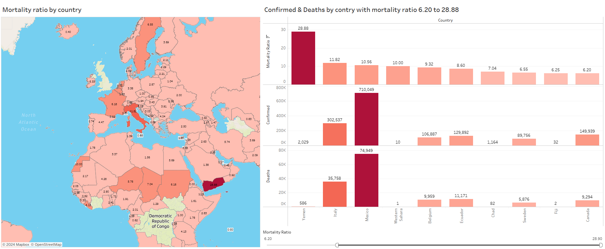

<h1 align="center">
     🌎🦠 COVID-19 Case Mortality Ratios - Dashboard in Tableau
       
      

     📊 Data Visualization
</h1>
<h3>📚 About Data</h3>

Dataset about COVID-19 confirmed cases, deaths, case mortality ratios, country, latitude, and longitude.

📍 The dataset is available via the following link: <a href="https://www.kaggle.com/datasets/paultimothymooney/coronavirus-covid19-mortality-rate-by-country">Kaggle Link</a>.

📍 Live Dashboard: <a href="https://public.tableau.com/views/COVID-19CaseMortalityRatiosbyCountry/Dashboard1?:language=en-US&:sid=&:redirect=auth&:display_count=n&:origin=viz_share_link">Tableau Link</a>

<h3>📌 Objectives</h3>

Using Tableau, a dashboard was created to visualize: 

<ul>
  <li><b>Mortality Ratio by Country: </b>Visualizing the percentage of deaths relative to confirmed cases for each country.</li>
  <li><b>Confirmed Cases and Deaths by Country: </b>Displaying the number of confirmed cases and deaths, with an interactive filter to explore data by mortality ratio.</li>
</ul>

<h3>Conclusion</h3>

he analysis of COVID-19 data reveals that the top 4 countries with the highest mortality ratios are:

<ul>
<li><b>Yemen</b> with a mortality ratio of 28.88</li>
<li><b>Italy</b> at 11.82</li>
<li><b>Mexico</b> at 10.56</li>
<li><b>Western</b> Sahara at 10.00</li>
<ul>

This highlights significant disparities in outcomes across countries, which could be attributed to differences in healthcare infrastructure, response strategies, population demographics, and testing/reporting accuracy. The dashboard also provides an interactive filter to explore Confirmed Cases, Deaths, and Mortality Ratios by country, offering deeper insights into the global impact of the pandemic.

